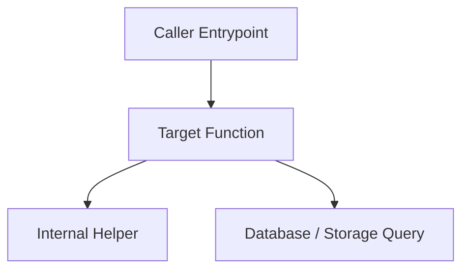

# Call Flow Tracer & Blast Radius Analysis

This skill guides the agent to map execution call hierarchies and analyze the impact of proposed changes on upstream callers and downstream dependencies.

## When to Use
- When refactoring or modifying a core function or method to understand what will be affected.
- When answering "What happens when function X is called?" or "What calls function Y?".
- When performing architectural reviews or debugging recursive or nested execution paths.

## Procedure

### 1. Identify Target Symbol & Origin
- Locate the function or method definition in the codebase.
- Note its signature, parameters, and return type.

### 2. Upstream Caller Analysis (Who calls this?)
- Search for references across the codebase to identify every call site:
  - Direct function invocations
  - Class method calls (`instance.method()`)
  - Route handlers or event listeners registering the function
- Map out the chain of callers up to the entry point (API endpoint, CLI command, or background worker).

### 3. Downstream Callee Analysis (What does this call?)
- Inspect the function body for:
  - Subroutines and helper calls
  - Database queries and external API network requests
  - Error handlers and fallback triggers

### 4. Blast Radius Assessment
Compile a blast radius summary before applying modifications:
- **Direct Consumers**: Modules and files directly calling the target symbol.
- **Transitive Impact**: Upstream entrypoints that rely on the behavior/contract of the target.
- **Breaking Change Risk**: High / Medium / Low based on public API exposure.

### 5. Formatting the Call Flow
Present the traced call flow using a clean Mermaid flowchart or indented trace:

