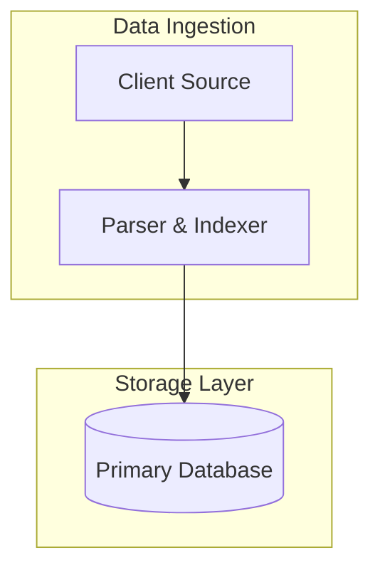
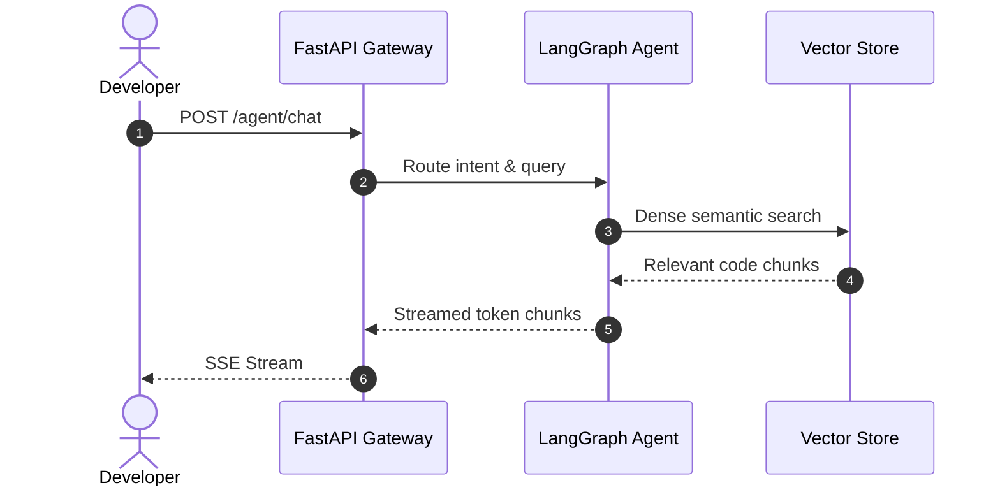
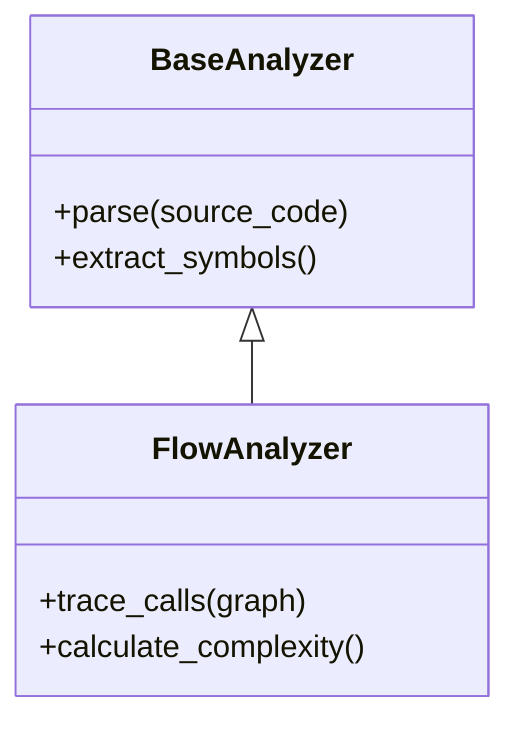

# Codebase Diagrammer & Mermaid Visualizer

This skill guides the agent to automatically extract architectural relationships and generate clean, valid Mermaid diagrams for implementation plans, walkthroughs, and documentation.

## When to Use
- When documenting system architectures or module dependencies in markdown artifacts.
- When generating visual call sequence flows between frontend, backend, and external databases.
- When illustrating class inheritance and interface implementations.

## Diagram Types & Syntax Standards

### 1. System Architecture / Flowchart (`flowchart TD` or `LR`)
- Use clear node labels with quotes if containing special characters: `id["Component Name (Details)"]`.
- Group related services using `subgraph`:

### 2. Sequence Diagrams (`sequenceDiagram`)
- Use for multi-agent workflows, API request-response lifecycles, and asynchronous streaming:

### 3. Class & Inheritance Models (`classDiagram`)
- Show attributes, methods, and relationships:
  - `<|--` for inheritance
  - `*--` for composition
  - `-->` for association

## Guidelines for Robust Diagrams
1. **Never use HTML tags inside node labels** (use markdown formatting or plain text).
2. **Always wrap complex labels in double quotes** (`["text with (brackets)"]`).
3. **Limit visible edges to 20-30 max** per diagram to maintain readability and avoid visual clutter.
