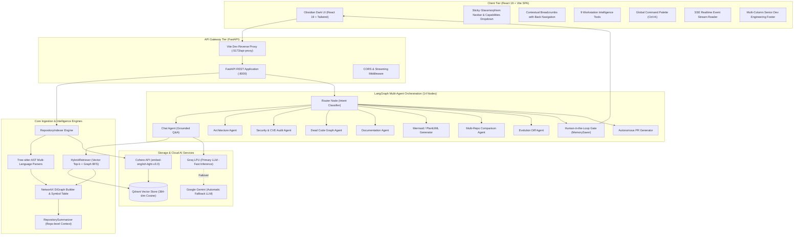
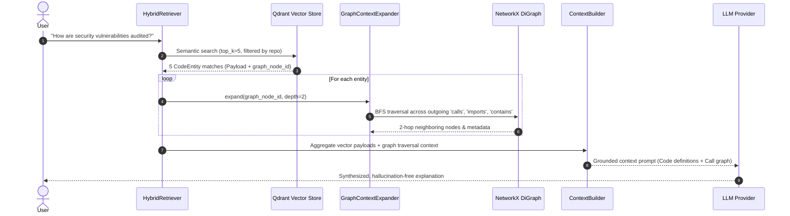

# Codebase RAG Assistant — Comprehensive Architecture & Technical Documentation

> **AI-Powered Repository Understanding & Developer Intelligence Platform**  
> *Repository:* [https://github.com/Mayank459/CodeBase](https://github.com/Mayank459/CodeBase)  
> *Version:* 2.1.0 | *Last Updated:* September 2026

---

## Table of Contents
1. [Executive Summary & The "Code-RAG" Problem](#1-executive-summary--the-code-rag-problem)
2. [High-Level System Architecture](#2-high-level-system-architecture)
3. [Ingestion & AST Parsing Pipeline](#3-ingestion--ast-parsing-pipeline)
4. [Vector Storage & Cohere Embeddings Engine](#4-vector-storage--cohere-embeddings-engine)
5. [Graph-Augmented Hybrid Retrieval (Vector + AST Graph)](#5-graph-augmented-hybrid-retrieval-vector--ast-graph)
6. [LangGraph Multi-Agent Orchestration Engine](#6-langgraph-multi-agent-orchestration-engine)
7. [LLM Provider Subsystem (Groq + Gemini Fallback)](#7-llm-provider-subsystem-groq--gemini-fallback)
8. [Feature Catalog & Technical Breakdown](#8-feature-catalog--technical-breakdown)
   - 8.1 Multi-Agent Pipeline Visualizer & Token Streaming
   - 8.2 Grounded Retrieval Evidence Drawer
   - 8.3 Security Command Center & Health Index Dial
   - 8.4 Dynamic Call Flow Tracer & Mermaid Hierarchy
   - 8.5 Syntax-Colorized Diff Viewer & Human-in-the-Loop (HITL) PR Gate
   - 8.6 Repository Hub & 6-Stage Indexing Stepper
   - 8.7 Architectural Analysis & Dependency Graph
   - 8.8 Automated Documentation Generation
   - 8.9 Dead Code Detection via Graph Centrality
   - 8.10 UML & System Diagram Generator (Mermaid.js)
   - 8.11 Multi-Repository Comparative Intelligence
   - 8.12 Repository Evolution & Commit Drift Analysis
   - 8.13 Real-Time SSE Ingestion Progress Streaming
9. [Page Structure & Multi-View Architecture](#9-page-structure--multi-view-architecture)
   - 9.1 Workstation Dashboard (Core Mission Control)
   - 9.2 About & Architecture Specification Page
   - 9.3 System Settings & Hyperparameter Hub
   - 9.4 Universal Command Palette & Search (`Ctrl+K` / `⌘K`)
   - 9.5 Code Confidentiality & Privacy Policy
   - 9.6 Terminal 404 Node Not Found Page
10. [Navigation System & Information Architecture](#10-navigation-system--information-architecture)
    - 10.1 Glassmorphism Sticky Navbar
    - 10.2 Interactive Brand Logo (Click-to-Home)
    - 10.3 Categorized Capabilities Mega Dropdown
    - 10.4 Dynamic Contextual Breadcrumbs
    - 10.5 Humanized Back Navigation
    - 10.6 Responsive Mobile Drawer Menu
    - 10.7 Multi-Column Senior Dev Engineering Footer
    - 10.8 High-Visibility Call-to-Actions (CTAs)
11. [Complete API Reference & Communication Protocols](#11-complete-api-reference--communication-protocols)
12. [Frontend Architecture & UI Design System](#12-frontend-architecture--ui-design-system)
13. [Deployment, DevOps, & Local Development Guide](#13-deployment-devops--local-development-guide)
14. [Summary Matrix & Key Differentiators](#14-summary-matrix--key-differentiators)

---

## 1. Executive Summary & The "Code-RAG" Problem

### 1.1 What is CodeBase RAG Assistant?
**CodeBase RAG Assistant** is an enterprise-grade developer intelligence platform. It allows software engineers, system architects, and security auditors to point to any Git repository or local source directory and immediately query, audit, trace, and visualize its execution hierarchy using natural language.

### 1.2 Why Traditional Document RAG Fails for Codebases
Standard RAG pipelines built for text documents (PDFs, Markdown notes, support articles) treat source code as flat text. They split code by arbitrary character lengths (e.g., 500 characters with 50-character overlap) or naive newlines. 

**This naive approach catastrophically fails for software codebases:**
1. **Severed Syntactic Scope**: A naive token window splits functions across chunks, severing decorators, type annotations, and docstrings from the logic body.
2. **Missing Relational Context**: Code is non-linear. If function `authorize_payment()` in `billing.py` invokes `verify_token()` in `auth.py`, plain text vector similarity cannot infer that `verify_token()` was executed inside `authorize_payment()`.
3. **Loss of Class & Module Hierarchies**: Chunks lack awareness of parent inheritance trees, interface implementations, and imported packages.
4. **Hallucinated Execution Flows**: When asked *"What is the complete execution path of user login?"*, a traditional vector search retrieves random snippets mentioning "login", but cannot trace true compiler call paths through routers, controllers, services, and database schemas.

### 1.3 The CodeBase RAG Solution: Hybrid AST-Graph + Vector RAG
CodeBase RAG Assistant overcomes this fundamental limitation through a multi-tiered approach:
- **Tree-sitter Abstract Syntax Tree (AST) Parsing**: Understands code structure at the formal grammar level (classes, functions, methods, imports, calls, variables).
- **NetworkX Directed Dependency Graphs**: Builds an explicit structural graph connecting files, modules, function invocations, inheritance hierarchies, and variable references.
- **Cohere Dense Embeddings (384-dim)**: Vectorizes semantically meaningful code entities (classes, functions, whole-repo summaries) indexed inside **Qdrant Vector Database**.
- **Graph-Augmented Hybrid Retrieval**: Executes a two-stage retrieval: top-$k$ semantic vector search + 2-hop breadth-first search (BFS) graph traversal to gather both definitions and callers/callees.
- **LangGraph Multi-Agent Orchestration**: Directs user queries through a 14-node state graph with intent-based routing, specialized agents, automatic fallbacks, and Human-in-the-Loop checkpoints.

---

## 2. High-Level System Architecture



---

## 3. Ingestion & AST Parsing Pipeline

When a repository URL or local directory is submitted:
1. **Ephemeral Clone**: Clones the repository into a temporary sandbox on disk using `GitPython`.
2. **File Scanner**: Traverses directory trees, filtering out `.git`, `node_modules`, `venv`, `dist`, binaries, and images.
3. **Tree-sitter AST Extraction**:
   - Parses code files into concrete syntax trees using Tree-sitter grammar parsers for Python, JavaScript, TypeScript, Go, Java, Rust, and C++.
   - Extracts complete `CodeEntity` objects: `name`, `entity_type` (function, class, method), `file_path`, `start_line`, `end_line`, `parameters`, `return_type`, `docstring`, `decorators`, and full source text.
4. **Dependency Graph Construction**:
   - Instantiates a NetworkX `DiGraph`.
   - Nodes represent files, classes, and functions with structural attributes.
   - Directed edges encode architectural relationships: `CONTAINS`, `CALLS`, `IMPORTS`, `INHERITS_FROM`.
5. **Ephemeral Storage Purge**: Once AST extraction and vector embedding are complete, the cloned raw source code on disk is immediately deleted via `shutil.rmtree()`.

---

## 4. Vector Storage & Cohere Embeddings Engine

- **Embedding Model**: Cohere `embed-english-light-v3.0` (384-dimensional dense vectors).
- **Batching**: Chunks entities into batches of 96 entities per API request to maximize throughput while staying within rate limits.
- **Storage**: Qdrant Vector Store with `Cosine` distance metric.
- **Payload Metadata**:
  - `repository_name`: Scopes multi-tenant search per repository.
  - `entity_type`: `class`, `function`, `method`, `summary`.
  - `file_path`: Source file location.
  - `start_line` & `end_line`: Precise file coordinates.
  - `graph_node_id`: Foreign key pointing to the corresponding node in the NetworkX graph.

---

## 5. Graph-Augmented Hybrid Retrieval (Vector + AST Graph)

The `HybridRetriever` (`app/retrieval/hybrid_retriever.py`) bridges semantic similarity with compiler dependency graphs.



### Context Expansion Details
The `GraphContextExpander` runs a breadth-first search (BFS) traversal up to depth 2:
- If function `audit_security()` is matched by vector similarity, graph traversal immediately retrieves:
  - The module containing `audit_security()`.
  - The functions and utility classes `audit_security()` calls.
  - Any external dependencies or imported modules it touches.
- Result: The LLM receives the function code **AND** its execution context in a single prompt.

---

## 6. LangGraph Multi-Agent Orchestration Engine

All intelligence workflows execute via a compiled **LangGraph StateGraph** (`app/agents/graph_builder.py`).

### 6.1 State Schema (`AgentState`)
```python
class AgentState(TypedDict):
    repository_name: str
    question: str
    history: list[dict]
    route: str
    answer: str
    repositories: list[str]
    old_repository: str
    new_repository: str
    pending_approval: Optional[dict]
```

### 6.2 The 14 Specialized Nodes:
1. **`router`**: Analyzes the query using intent classification and sets the `route` edge.
2. **`chat`**: Standard conversational RAG grounded in hybrid vector + graph context.
3. **`architecture`**: Analyzes structural composition, module complexity, and class inheritance.
4. **`flow`**: Traces call graphs ("What happens when X is invoked?").
5. **`documentation`**: Auto-generates structured technical Markdown documentation.
6. **`security`**: Static regex and pattern audit for credentials, CVEs, and insecure patterns.
7. **`security_fix`**: Formulates remediation code patches and test cases.
8. **`dead_code`**: Traverses AST graph for zero in-degree unreferenced functions/classes.
9. **`uml`**: Generates Mermaid and PlantUML class and sequence diagrams.
10. **`architecture_diagram`**: High-level component and subsystem flowcharts.
11. **`comparison`**: Compares architecture metrics between two indexed repositories.
12. **`evolution`**: Analyzes changes between two versions or commits of a codebase.
13. **`await_approval`**: LangGraph interrupt gate that halts execution for Human-in-the-Loop review.
14. **`pr`**: Automated Pull Request generator synthesizing patches and markdown PR drafts.

---

## 7. LLM Provider Subsystem (Groq + Gemini Fallback)

To ensure maximum speed and 100% uptime:
- **Primary Provider**: **Groq LPU** (`qwen/qwen3.8-27b` / `llama-3.3-70b-versatile`). Ultra-low latency inference (~300 tokens/second).
- **Fallback Provider**: **Google Gemini** (`gemini-2.5-flash-latest` / `gemini-2.0-flash`).
- **Resilience Strategy**: Any network timeout, rate limit (HTTP 429), or 5xx error on Groq triggers transparent, seamless failover to Gemini.
- **Streaming Support**: Unified Python generator streaming chunk-by-chunk via Server-Sent Events (SSE).

---

## 8. Feature Catalog & Technical Breakdown

### 8.1 Multi-Agent Pipeline Visualizer & Token Streaming
- **Live Pipeline Visualizer (`AgentPipelineVisualizer.jsx`)**: Displays real-time progress across 5 discrete agent states:
  `Intent Router` ➔ `Specialized Agent` ➔ `Vector Search (Qdrant)` ➔ `AST Graph (NetworkX)` ➔ `LLM Generation`.
- Shows animated pulse effects during active processing and green checkmarks upon completion.
- **Real-Time Token Streaming**: Streams generated Markdown tokens smoothly into the UI via SSE `/agent/chat-stream`.

### 8.2 Grounded Retrieval Evidence Drawer (`RetrievalEvidenceDrawer.jsx`)
- Every AI response features a collapsible *"Grounded Retrieval Evidence"* inspector.
- Reveals exact file paths, line number coordinates, matched AST entities (classes/functions), and 2-hop graph relations traversed via BFS.
- Eliminates AI hallucinations by providing complete transparency into the grounding facts.

### 8.3 Security Command Center & Health Index Dial (`SecurityTab.jsx`)
- **Security Health Index Dial**: Circular SVG gauge computing an overall repository health score (0–100) with risk grade badges (`A+`, `B`, `C`, `D`).
- **Severity Counters**: Color-coded tiles for `Critical`, `High`, `Medium`, and `Low` findings.
- **Interactive Finding Cards**:
  - Filter by severity chips (`ALL`, `CRITICAL`, `HIGH`, `MEDIUM`, `LOW`).
  - Search findings by keyword, vulnerability ID, or file path.
  - Vulnerability cards show severity badges, file path, line numbers, description, code snippets, and a **"⚡ Fix with PR"** button that directly stages automated remediation.

### 8.4 Dynamic Call Flow Tracer & Mermaid Hierarchy (`ArchitectureTab.jsx`)
- **Call Flow Tracer**: Input field allowing engineers to trace any function or route (e.g. `index_repository`, `chat_with_agent`, `authenticate`).
- **Mermaid Visual Diagram**: Dynamically queries the NetworkX graph and renders an interactive call hierarchy diagram from caller to callee.
- **Popular Target Presets**: Quick buttons for popular targets (`index_repository()`, `chat_with_agent()`, `clone_repository()`, `retrieve()`).
- **Module Density & Centrality Hubs**: Table showing class and function density and top architectural hubs.

### 8.5 Syntax-Colorized Diff Viewer & Human-in-the-Loop (HITL) PR Gate (`DiffViewer.jsx` & `PullRequestTab.jsx`)
- **GitHub-Style Syntax Diff Viewer**: Colorized additions (`+` in green) and deletions (`-` in red) with line numbers and copy-diff capability.
- **Human-in-the-Loop Approval Gate**: Clearly displays when LangGraph execution is suspended waiting for operator authorization.
- Explicit approval vs. rejection controls with confetti celebration upon commit.

### 8.6 Repository Hub & 6-Stage Indexing Stepper (`IndexDrawer.jsx`)
- **Repository Readiness Chip**: Displays **`AST ✓ Graph ✓ Embeddings ✓ Ready`** when a repository is loaded.
- **Real-Time Indexing Stepper**: Visually displays the 6 discrete indexing stages above the terminal console:
  `1. Clone Repo` ➔ `2. Scan Files` ➔ `3. AST Parse` ➔ `4. Build Graph` ➔ `5. Embeddings` ➔ `6. Qdrant Store`.

### 8.7 Architectural Analysis & Dependency Graph
- Structural breakdown of the repository: total files, parsed entities, modules, and classes.
- Dependency graph metrics: identifies core modules by edge degree centrality.
- File-by-file symbol breakdown.

### 8.8 Automated Documentation Generation
- Produces comprehensive Markdown documentation for any class or module.
- Generates function signatures, argument types, return values, docstring summaries, and usage examples.

### 8.9 Dead Code Detection via Graph Centrality
- Computes in-degree metrics across all function and class nodes in the NetworkX graph.
- Isolates symbols that have zero callers and are not marked as public API entry points.

### 8.10 UML & System Diagram Generator (Mermaid.js)
- Emits clean, syntactically valid **Mermaid.js** and **PlantUML** code.
- Types: Class diagrams, dependency diagrams, module interactions.
- Provides one-click integration with the official **Mermaid Live Editor**.

### 8.11 Multi-Repository Comparative Intelligence
- Side-by-side architectural diff between two distinct repositories.
- Compares entity density, language distribution, modularity, and dependencies.

### 8.12 Repository Evolution & Commit Drift Analysis
- Diff two versions or Git branches of the same codebase.
- Highlights added/removed functions, refactored classes, and structural shifts.

### 8.13 Real-Time SSE Ingestion Progress Streaming
- Long-running repository cloning, parsing, and embedding stream real-time progress updates via Server-Sent Events (`/repository/index-stream`).
- The UI renders an interactive terminal drawer with live progress bars and step indicators.

---

## 9. Page Structure & Multi-View Architecture

The application is structured into focused, professional views tailored specifically for software engineers and architects, eliminating consumer/ecommerce clutter:

### 9.1 Workstation Dashboard (Core Mission Control)
- **Primary Mission Control**: Features the hero banner, runtime status, SSE repository indexing drawer, and the 9 developer intelligence tools (`Intelligence Chat`, `Architecture`, `Security Audit`, `Dead Code`, `Docs`, `UML`, `Multi-Repo`, `Evolution`, `Pull Request`).
- **Global Header**: High-contrast Obsidian Dark navigation bar with page switcher tabs (`Workstation`, `About`, `Settings`), `Search (⌘K)` trigger button, and live backend connection badge.

### 9.2 About & Architecture Specification Page (`AboutPage.jsx`)
- **Technical Narrative**: Details the "Code-RAG Gap" and how vanilla RAG fails at structural relationships (call trees, inheritance, and imports).
- **Core Pipeline Tiers**: 4-column card breakdown of AST Tree Parsing, Hybrid Qdrant Vector Storage, NetworkX Knowledge Graphs, and LangGraph Multi-Agent Workflows.
- **Technology Stack Matrix**: Exhaustive table covering frontend, backend, vector DB, LLMs, embeddings, and deployment layers.

### 9.3 System Settings & Hyperparameter Hub (`SettingsPage.jsx`)
- **Custom API Key Management**: Allows developers to supply custom keys for `GROQ`, `GEMINI`, and `COHERE` stored securely in the browser's local storage.
- **Model Selection & Sampling Parameters**: Select LLM models (e.g. `llama-3.3-70b-versatile`, `gemini-1.5-pro`, `gemini-2.0-flash`) and adjust temperature sliders.
- **RAG & Graph Hyperparameters**: Interactive sliders for Vector Retrieval Top-K (`1 - 20`) and Graph Expansion Depth (`1 - 4 BFS hops`).
- **Backend Endpoint Switcher**: Quick toggle between Live Render Deployment (`https://codebase-ys83.onrender.com`) and Local Development (`http://localhost:8000`).

### 9.4 Universal Command Palette & Search (`Ctrl+K` / `⌘K`) (`GlobalSearchModal.jsx`)
- **Universal Keyboard Shortcut**: Activated via `Ctrl+K` or `⌘K` from anywhere in the app, or by clicking the Navbar Search button.
- **Quick Jump Navigation**: Instant fuzzy filtering across all 9 developer workstation tools and system pages.
- **Direct AI Query Fallback**: Type any question into the search bar and press `Enter` to directly dispatch the query to the Intelligence Chat RAG agent.

### 9.5 Code Confidentiality & Privacy Policy (`PrivacyPolicyPage.jsx`)
- **Ephemeral Clone Lifecycle**: Explains how GitHub repositories are cloned into temporary sandboxes, parsed into memory, and deleted immediately post-indexing.
- **Zero Training Guarantee**: Clear disclosures that user code is never retained or used to train foundational AI models.
- **Client-Side Credential Storage**: Guarantees that API keys never hit persistent backend databases and remain in the user's browser `localStorage`.

### 9.6 Terminal-Style 404 Not Found (`NotFoundPage.jsx`)
- **Developer-Themed Error Experience**: Stylized as a terminal exception (`404: AST_NODE_NOT_FOUND`).
- **Diagnostic Trace**: Shows simulated unresolved AST symbol references and missing call frames.
- **Quick Recovery**: Includes a "Return to Workstation" button that restores the main dashboard with one click.

---

## 10. Navigation System & Information Architecture

### 10.1 Glassmorphism Sticky Navbar (`Navbar.jsx`)
- Sticky header with high-blur backdrop (`#080c14/90` with `backdrop-blur-xl`).
- Integrates brand logo, navigation links, capabilities dropdown, command palette trigger, repository status chip, and live backend connection badge.

### 10.2 Interactive Brand Logo (Click-to-Home)
- Hexagonal circuit CPU emblem with gradient border and hover aura.
- Clicking the logo smoothly returns to the Workstation dashboard (`activePage = 'dashboard'`).
- Crisp typography displaying `CodeBase` + version tag `RAG v2.0` + subtitle `Repository Intelligence Engine`.

### 10.3 Categorized Capabilities Mega Dropdown
Houses all 9 developer capabilities organized into 3 logical tiers:
1. **Code Intelligence**: Intelligence Chat (LangGraph), Architecture Graph (AST), Security Audit (CVE).
2. **Code Hygiene**: Dead Code Analysis, Documentation Generator, UML Diagrams (Mermaid).
3. **Multi-Repo & Git**: Multi-Repo Compare (Diff), Commit Evolution (History), Autonomous PR (HITL).
- Selecting any item directly navigates to the Workstation and activates the respective tool tab.

### 10.4 Dynamic Contextual Breadcrumbs (`Breadcrumbs.jsx`)
- Renders at the top of the main container:
  - Dashboard: `Home / Workstation / [Active Tool Label]` (e.g., `Home / Workstation / Security Audit`).
  - Settings: `Home / Configuration / System Settings`.
  - About: `Home / Platform / About & Architecture`.
  - Privacy: `Home / Trust & Governance / Privacy Policy`.
- Every crumb is interactive and keyboard accessible.

### 10.5 Humanized Back Navigation
- Prominent `← Back to Workstation` action button in the breadcrumb bar and within sub-page headers whenever the operator navigates away from the primary workstation.

### 10.6 Responsive Mobile Drawer Menu
- Viewport collapse for mobile devices (`md:hidden`).
- Hamburger toggle button in the navbar opens a slide-down mobile drawer containing:
  - Mobile Search button (`⌘K`).
  - Navigation links (`Workstation`, `About`, `Settings`).
  - Workstation tools list.
  - Privacy policy and GitHub external links.

### 10.7 Multi-Column Senior Dev Engineering Footer (`Footer.jsx`)
- **4 Distinct Navigation Columns**:
  1. **Brand & Ingestion State**: Engine logo, summary, active repository badge (`Indexed: CodeBase`), and GitHub star CTA.
  2. **Workstation Tools**: Direct deep-links to all 9 intelligence capabilities.
  3. **Platform & Specs**: Links to Workstation, About, System Settings, README, and API Spec.
  4. **Trust & Governance**: Links to Privacy Policy, Ephemeral sandboxes, zero-retention rules, and Terminal 404.
- **Bottom Bar**: Tech stack pills (`Tree-sitter AST`, `Cohere 384d`, `Qdrant Vector DB`, `NetworkX Graph`, `LangGraph HITL`) and `⌘K` command shortcut hint.

### 10.8 High-Visibility Call-to-Actions (CTAs)
- **Navbar Primary CTA**: `⚡ Ingest Repo` (or `Active Repo` badge) triggering the index drawer.
- **Navbar Secondary CTA**: `Search... ⌘K` opening the Command Palette.
- **Hero Section CTAs**: Direct action buttons for `Ingest Repository`, `Security Audit`, and `Quick Search`.

---

## 11. Complete API Reference & Communication Protocols

### 11.1 Repository Endpoints (`/repository`)

| Method | Endpoint | Description | Request Body | Response |
|---|---|---|---|---|
| `POST` | `/repository/clone` | Clones a git repo to disk | `{"repo_url": "..."}` | `{"message": "..."}` |
| `POST` | `/repository/scan` | Scans files in repo | `{"repo_url": "..."}` | `{"files_found": 42}` |
| `POST` | `/repository/parse` | Synchronously indexes repo | `{"repo_url": "...", "force": false}` | Index summary dict |
| `POST` | `/repository/index-stream` | **SSE Stream**: Live indexing events | `{"repo_url": "...", "force": false}` | `text/event-stream` chunks |
| `POST` | `/repository/reindex` | Force re-indexes (bypasses cache) | `{"repo_url": "...", "force": true}` | Index summary dict |
| `POST` | `/repository/reindex-stream` | **SSE Stream**: Live re-index events | `{"repo_url": "...", "force": true}` | `text/event-stream` chunks |
| `POST` | `/repository/architecture` | Structural metrics & modules | `{"repository_name": "..."}` | Architectural analysis dict |
| `POST` | `/repository/chat` | Synchronous RAG chat query | `{"repository_name": "...", "question": "..."}` | `{"answer": "..."}` |
| `POST` | `/repository/debug-search` | Raw vector + graph retrieval debug | `{"repository_name": "...", "question": "..."}` | Payloads & graph context |

### 11.2 Agent Endpoints (`/agent`)

| Method | Endpoint | Description | Request Body | Response |
|---|---|---|---|---|
| `POST` | `/agent/chat` | LangGraph agent execution | `{"repository_name": "...", "question": "...", "thread_id": "..."}` | Result dict or `{approval_needed: true}` |
| `POST` | `/agent/chat-stream` | **SSE Stream**: Token streaming | `{"repository_name": "...", "question": "...", "thread_id": "..."}` | Token SSE stream |
| `POST` | `/agent/approve` | Resumes paused HITL workflow | `{"request_id": "...", "approved": true}` | Resumed LangGraph result |
| `POST` | `/agent/compare` | Multi-repo comparison | `{"repositories": ["repoA", "repoB"]}` | Comparison metrics & report |
| `POST` | `/agent/evolution` | Version evolution diff | `{"old_repository": "...", "new_repository": "..."}` | Evolution breakdown |

---

## 12. Frontend Architecture & UI Design System

The frontend is a custom-engineered, senior-developer-focused Single Page Application (SPA) built with **React 19**, **Vite**, and **Tailwind CSS**.

### 12.1 Obsidian Dark Design System (`index.css`)
- **Theme**: Deep obsidian palette (`#07090e`, `#0e131f`, `#141a2b`) paired with subtle borders (`rgba(255, 255, 255, 0.08)`) and indigo/cyan brand accents.
- **Typography**: Inter / Plus Jakarta Sans for UI elements; JetBrains Mono for code blocks, file paths, and metrics.
- **Micro-Interactions**: Glassmorphism blur backdrops, animated radar-pulse status dots, hover scale transitions, and confetti animations on successful PR authorization.

### 12.2 Responsive Tab Navigation Matrix
The workstation houses all 9 core developer tools:
1. `Intelligence Chat` (LangGraph)
2. `Architecture` (AST)
3. `Security Audit` (CVE)
4. `Dead Code` (Analysis)
5. `Documentation` (Generator)
6. `UML Diagrams` (Mermaid)
7. `Multi-Repo` (Diff)
8. `Evolution` (History)
9. `Pull Request` (HITL)

**Key Layout Safeguards**:
- **Desktop (>=1200px)**: Proportional distribution (`flex: 1 1 auto; justify-content: center;`) ensures all 9 tabs stretch evenly with zero clipping.
- **Responsive Overflow**: Features horizontal mouse-wheel scrolling, floating left/right chevron navigation buttons, edge fade indicators, and auto-scroll-to-active-tab.

### 12.3 Background Keep-Alive System
- A built-in client hook (`useKeepAlive`) periodically pings the backend every 4 minutes.
- Prevents free-tier cloud platforms (like Render) from putting the backend container to sleep during active user sessions.

---

## 13. Deployment, DevOps, & Local Development Guide

### 13.1 Prerequisites
- Node.js v18+ and npm v9+
- Python 3.11 or 3.12
- Docker & Docker Compose (for local Qdrant)
- API Keys: `GROQ_API_KEY`, `GEMINI_API_KEY`, `COHERE_API_KEY`

### 13.2 Environment Variables (`.env`)
```bash
# LLM Providers
GROQ_API_KEY=gsk_your_groq_api_key_here
GEMINI_API_KEY=AIzaSy_your_gemini_api_key_here

# Embeddings
COHERE_API_KEY=your_cohere_api_key_here

# Qdrant Vector DB (Cloud or Local)
QDRANT_HOST=localhost
QDRANT_PORT=6333
# QDRANT_URL=https://your-cloud-qdrant-instance.qdrant.tech
# QDRANT_API_KEY=your_qdrant_cloud_api_key
```

### 13.3 Local Development Setup

#### 1. Start Qdrant Vector Database
```bash
docker-compose up -d
```

#### 2. Start FastAPI Backend
```bash
python -m venv venv
# Windows:
.\venv\Scripts\activate
# Linux/Mac:
source venv/bin/activate

pip install -r requirements.txt
uvicorn main:app --reload --port 8000
```

#### 3. Start React Frontend
```bash
cd frontend
npm install
npm run dev
```
Open **`http://localhost:5173`** in your browser.

### 13.4 Production Container Deployment (Docker)
The included `Dockerfile` packages the FastAPI backend for production:
```dockerfile
FROM python:3.12-slim
WORKDIR /app
COPY requirements.txt .
RUN pip install --no-cache-dir -r requirements.txt
COPY . .
EXPOSE 8000
CMD ["uvicorn", "main:app", "--host", "0.0.0.0", "--port", "8000"]
```

---

## 14. Summary Matrix & Key Differentiators

| Capability | Standard Vector RAG | CodeBase RAG Assistant |
|---|---|---|
| **Chunking Strategy** | Naive character/line splits | **Compiler-level Tree-sitter AST parsing** |
| **Relational Awareness** | None (pure text similarity) | **NetworkX DiGraph (calls, imports, inheritance)** |
| **Context Assembly** | Isolated top-$k$ snippets | **Hybrid Vector Top-$k$ + 2-Hop BFS Graph Traversal** |
| **Agent Architecture** | Single monolithic prompt | **14-Node LangGraph StateGraph with Intent Router** |
| **Execution Transparency** | Black-box response | **Multi-Agent Pipeline Stepper + Retrieval Evidence Drawer** |
| **Security Auditing** | Generic text advice | **Security Command Center with 0-100 Health Score & PR Fix** |
| **Execution Flow Tracing**| Hallucinated approximations | **Dynamic Call Flow Tracer with Live Mermaid Hierarchy** |
| **Code Modification** | Unverified copy-paste snippets | **Syntax-Colorized Diff Viewer with HITL Approval Gate** |
| **Navigation & Search** | Primitive header links | **Command Palette (⌘K) + Breadcrumbs + Mega Dropdown** |
| **LLM Reliability** | Single provider point of failure | **Dual-Engine (Groq LPU primary + Gemini fallback)** |
| **Code Privacy** | Indefinite cloud retention | **Ephemeral Sandboxes (Purged immediately post-index)** |
| **Progress Visibility** | Blind loading spinner | **Real-Time Server-Sent Events (SSE) Terminal Stream** |

---

*This document serves as the authoritative technical reference for the CodeBase RAG Assistant platform.*
