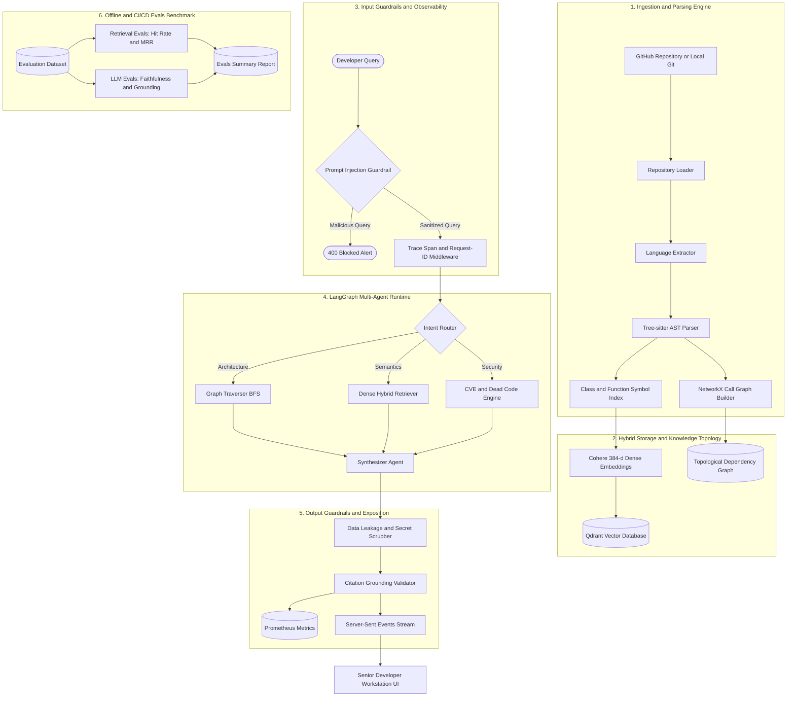

<div align="center">

# ⚡ CodeBase: Repository Intelligence Engine
### High-Performance AST Parsing • Topological Call Graph Traversal • Multi-Agent RAG • Enterprise Guardrails • Observability & Evals

[](https://www.python.org/)
[](https://fastapi.tiangolo.com/)
[](https://react.dev/)
[](https://vitejs.dev/)
[](https://langchain-ai.github.io/langgraph/)
[](https://qdrant.tech/)
[](https://tree-sitter.github.io/)
[](https://prometheus.io/)
[](.github/workflows/ci.yml)
[](LICENSE)

<p align="center">
  <b>CodeBase</b> is an enterprise-grade developer intelligence platform engineered for full-stack codebase comprehension. By unifying deep abstract syntax tree (AST) decomposition, graph-theoretic topological call tracing, hybrid vector retrieval, enterprise safety guardrails, deep telemetry, and continuous RAG evaluation, CodeBase transforms sprawling repositories into an actionable, observable, queryable intelligence plane.
</p>

[Explore Capabilities](#-capabilities-suite) •
[Architecture Spec](#-system-architecture) •
[Guardrails & Safety](#-enterprise-guardrails-engine) •
[Evals Suite](#-retrieval--llm-output-evals) •
[Observability](#-observability--telemetry) •
[DevOps & Docker](#-devops-cicd--monitoring) •
[Quickstart](#-quickstart-guide)

</div>

---

## 🏛️ System Architecture

CodeBase operates on a **Dual-Plane Indexing Architecture** with built-in **Input/Output Guardrails**, **Distributed Telemetry**, and **Continuous Evaluation**:



---

## ⚡ Capabilities Suite

CodeBase provides 9 core intelligence tools complemented by production-grade platform modules:

| Module | Core Technology | Description |
|---|---|---|
| **🧠 Intelligence Chat** | `LangGraph` + `Qdrant` | Contextual conversational agent with character-by-character SSE streaming, AST evidence pills, and multi-agent execution telemetry. |
| **⚡ Decision & Routing Engine** | `Laya` + `System 1 Engine` | Non-autoregressive sub-35ms typed decision routing across 100+ languages with automatic fallback to heuristics. |
| **🛡️ Enterprise Guardrails** | `Laya Semantic Triage` + `Regex` | Input prompt injection protection (REST & SSE), streamed token secret/PII scrubbing, and citation grounding checks. |
| **📊 Retrieval & LLM Evals** | `RetrievalEvaluator` + `LLMOutputEvaluator` | Automated regression testing for Hit Rate@K, MRR, Faithfulness, and Citation Grounding. |
| **📈 Workflow Observability** | `Prometheus` + `Structured JSON` | Latency histograms, token counters, distributed tracing spans, and `/metrics` scrape endpoint. |
| **🕸️ Architecture Call Graph** | `NetworkX` + `Cytoscape` | Interactive 2D topological call-graph visualizer exploring caller/callee paths and modular coupling. |
| **🔒 Automated Security Audit** | `Static AST` + `CVSS` | Vulnerability assessment across code surfaces and dependencies with CVSS severity badges and automated remediation patch drafts. |
| **🔧 Context-Aware Remediation** | `PatchGenerator` + `Diff Engine` | Contextual unified diff generation across CWE-95, CWE-78, CWE-327, CWE-798, CWE-502, CWE-89, and CWE-79. |
| **✂️ Dead Code Detection** | `Symbol Resolution` | Static symbol cross-reference engine identifying unreferenced functions, dangling classes, and zero-callsite methods. |
| **📚 Documentation Generator** | `AST Metadata` + `LLM` | Generates standardized Google/NumPy-compliant docstrings and comprehensive Markdown documentation suites. |
| **📐 UML Class & Sequence Models** | `Mermaid.js (Strict)` | Generates interactive UML class diagrams, call sequence diagrams, and architecture swimlanes with XSS-safe strict rendering. |
| **🔄 Multi-Repo Diff Analyzer** | `AST Semantic Diff` | Compares architecture, interfaces, and symbol implementations across distinct repositories. |
| **🚀 Autonomous PR Gate** | `HITL Verification` | Human-in-the-loop remediation gate allowing engineers to inspect, review, and approve automated patch branches with role authorization. |

---

## 🛡️ Enterprise Guardrails Engine

The platform incorporates automated guardrail interceptors on both incoming prompts and synthesized outputs (`app/guardrails/`):

1. **Prompt Injection & Jailbreak Defense (`PromptInjectionGuardrail`)**:
   - Detects and intercepts instruction override attempts (e.g., *"ignore previous instructions"*), role reversals, system prompt extraction, and raw delimiter injection (`<|im_start|>`).
   - Blocks unauthorized queries with early status alerts and increments telemetry counters.
2. **Data Leakage & Secret Scrubbing (`DataLeakageGuardrail`)**:
   - Automated regex scrubbing for high-risk tokens in responses: AWS access keys, OpenAI/Groq/Anthropic/Gemini API keys, RSA/SSH private keys, JWT tokens, DB connection strings, and PII email addresses.
   - Automatically replaces secrets with non-sensitive identifiers (`[REDACTED_API_KEY]`).
3. **Citation Grounding Validator (`CitationValidatorGuardrail`)**:
   - Extracts all file paths and AST symbols cited in model responses and cross-references them against the active repository index.
   - Automatically flags unindexed or hallucinated files with grounding warning annotations.

---

## 📊 Retrieval & LLM Output Evals

CodeBase features an offline and CI/CD evaluation harness (`evals/`) to continuously benchmark retrieval accuracy and generation quality:

### Metrics Measured
- **Retrieval Hit Rate @ K**: Frequency at which target files/symbols appear in top-$K$ retrieved chunks.
- **Mean Reciprocal Rank (MRR @ K)**: Quantifies the average rank of the first relevant code context.
- **Output Faithfulness**: Measures whether statements and entity names in the answer strictly derive from the retrieved AST context.
- **Citation Grounding Score**: Ratio of valid, indexed file paths cited in the answer versus total cited paths.
- **Answer Relevancy**: Query-to-response semantic alignment score.

### Running the Benchmark Suite
```bash
# Execute the automated benchmark runner
python evals/run_evals.py
```

*Sample benchmark output:*
```
============================================================
 [BENCHMARK] CODEBASE EVALUATION SUITE
============================================================
[*] Retrieval Hit Rate @ 1:      100.0%
[*] Retrieval Hit Rate @ 3:      100.0%
[*] Mean Reciprocal Rank (MRR):  1.0000
[*] Output Faithfulness Score:   85.2%
[*] Answer Relevancy Score:      79.4%
[*] Citation Grounding Score:    100.0%
============================================================
[SUCCESS] Benchmark completed successfully! Saved to 'evals_report.json'.
```

---

## 📈 Observability & Telemetry

Full-fidelity observability across the entire agent lifecycle (`app/observability/`):

- **Structured JSON Logging**: All logs are emitted in JSON format with ISO-8601 UTC timestamps, request IDs, repository identifiers, and trace IDs.
- **Distributed Tracing Spans**: In-memory span manager (`tracer.span(...)`) tracking timing, token consumption, and agent state transitions.
- **Prometheus Metrics (`/metrics`)**:
  - `codebase_requests_total`: Request counts labeled by endpoint and HTTP/guardrail status (`success`, `blocked`).
  - `codebase_latency_seconds`: Operation duration histograms (`retrieval`, `llm_generation`, `guardrail_validation`).
  - `codebase_llm_tokens_total`: Token consumption breakdown by model and token type (`prompt`, `completion`).
  - `codebase_guardrail_violations_total`: Safety violation counters (`prompt_injection`, `secret_leakage`, `citation_fail`).

---

## 🚢 DevOps, CI/CD & Monitoring

The repository includes production deployment configurations and automated pipelines:

- **Docker Multi-Stage Container (`Dockerfile`)**: Lightweight Python 3.12 image with glibc memory tuning (`MALLOC_ARENA_MAX=2`) and built-in `HEALTHCHECK` probe.
- **Full-Stack Orchestration (`docker-compose.yml`)**:
  - `backend`: FastAPI API service with metrics (`http://localhost:10000`)
  - `qdrant`: Persistent vector database (`http://localhost:6333`)
  - `prometheus`: Automated metrics scraper (`http://localhost:9090`)
- **Prometheus Scrape Configuration (`monitoring/prometheus.yml`)**: Scrapes the backend `/metrics` endpoint every 15 seconds.
- **GitHub Actions CI/CD (`.github/workflows/ci.yml`)**:
  - Automated code linting via `ruff`.
  - Comprehensive unit and regression test execution via `pytest`.
  - Automated evaluation benchmark execution and artifact upload.
  - Docker container build verification.

---

## 🚀 Quickstart Guide

### 1. Prerequisites
- **Python 3.11+**
- **Node.js 18+** & `npm`
- **Docker & Docker Compose** (optional, for containerized deployment)
- API Keys: `GEMINI_API_KEY`, `COHERE_API_KEY`, `GROQ_API_KEY` (optional)

### 2. Environment Setup

```bash
git clone https://github.com/Mayank459/CodeBase.git
cd CodeBase

# Install Python dependencies
pip install -r requirements.txt

# Configure environment variables
cp .env.example .env
```

### 3. Running with Docker Compose (Full Stack)

Launch Backend, Qdrant Vector Store, and Prometheus Monitoring with a single command:

```bash
docker-compose up -d --build
```
- **Backend API**: `http://localhost:10000`
- **API Health**: `http://localhost:10000/health`
- **Prometheus Metrics**: `http://localhost:10000/metrics`
- **Prometheus Dashboard**: `http://localhost:9090`
- **Qdrant Dashboard**: `http://localhost:6333/dashboard`

### 4. Running Native Development

```bash
# Terminal 1: Backend API
uvicorn main:app --host 0.0.0.0 --port 10000 --reload

# Terminal 2: React Frontend Workstation
cd frontend
npm install
npm run dev
```

Open **`http://localhost:5173`** in your browser.

### 5. Running Tests & Benchmarks

```bash
# Run unit & guardrail tests
pytest tests/ -v

# Run RAG & LLM evaluation benchmarks
python evals/run_evals.py
```

---

## 🔌 API Specification

### Health & Observability
- `GET /health`: Service health check.
- `GET /metrics`: Prometheus telemetry scrape endpoint.

### Repository Ingestion Endpoints
- `POST /repository/index-stream`: Streams real-time SSE progress during AST parsing, call-graph construction, and vector embeddings.
- `POST /repository/architecture`: Returns topological nodes, call edges, complexity distribution, and module dependency matrices.

### Agent & Intelligence Endpoints
- `POST /agent/chat`: Synchronous multi-agent chat with input/output guardrail enforcement and metric recording.
- `POST /agent/chat-stream`: Real-time SSE token stream from the LangGraph agent.
- `POST /agent/compare`: Multi-repository architectural comparison.
- `POST /agent/evolution`: Git commit history and complexity drift analysis.
- `POST /agent/approve`: Human-in-the-loop review and approval gate for automated PR drafts.

---

## 📂 Codebase Directory Architecture

```
CodeBase/
├── .github/workflows/ci.yml          # GitHub Actions CI/CD pipeline
├── app/                              # Backend Intelligence Engine (FastAPI)
│   ├── api/routes/                   # REST & SSE streaming routers
│   ├── agents/                       # LangGraph nodes (Router, Retriever, Traverser, Synthesizer)
│   ├── analysis/                     # Call flow, modular complexity & security analyzers
│   ├── chat/                         # LLM provider orchestration (Groq, Gemini)
│   ├── core/                         # Settings, logging, and security constants
│   ├── embeddings/                   # Cohere 384-dim dense embedding service
│   ├── graph/                        # NetworkX directed call graph builder
│   ├── guardrails/                   # Prompt injection, secret scrubber, citation validator
│   ├── hitl/                         # Human-in-the-Loop patch gate & review states
│   ├── indexing/                     # Git clone worker, scanner, and AST parser
│   ├── observability/                # Prometheus metrics, tracer spans, JSON logger
│   ├── parsers/                      # Tree-sitter grammars & symbol resolution
│   ├── retrieval/                    # Hybrid vector + lexical query engine
│   └── storage/                      # Qdrant client connection pool
├── evals/                            # Retrieval & LLM evaluation suite
│   ├── dataset.json                  # Ground-truth evaluation scenarios
│   ├── retrieval_eval.py             # Hit Rate@K & MRR metrics
│   ├── llm_eval.py                   # Faithfulness, Relevancy & Citation metrics
│   └── run_evals.py                  # Benchmark runner CLI
├── monitoring/
│   └── prometheus.yml                # Prometheus scraping configuration
├── frontend/                         # Senior Developer Workstation (React + Vite)
│   ├── src/components/               # Chat, Graph, Security, DeadCode, Docs, UML tabs
│   └── index.css                     # Obsidian dark design system & tokens
├── tests/                            # Pytest test suite (unit, guardrails, evals, obs)
├── main.py                           # Application entry point & middleware
├── Dockerfile                        # Multi-stage production container with healthcheck
├── docker-compose.yml                # Multi-service stack (backend, qdrant, prometheus)
└── requirements.txt                  # Python dependencies
```

---

## 🛡️ Strix Autonomous Security Testing & Agent Skills

CodeBase is integrated with [**Strix**](https://github.com/usestrix/strix), the autonomous AI penetration testing tool. Strix enables continuous white-box security audits, API penetration tests, and automated vulnerability validation.

### Installed Strix Agent Skills
The repository is equipped with 9 specialized agent skills located in `.agents/skills/`:
- `find-security-vulnerabilities-in-code`: White-box AI security review reasoning over source data flows, routes, and authorization boundaries.
- `api-security-testing`: OWASP API Security Top 10 automated testing with validated exploit proof-of-concepts.
- `application-security-testing`: End-to-end product security review and ranked remediation planning.
- `ci-security-scanning-with-strix`: Diff-scoped pre-merge security gating in CI/CD pipelines.
- `fix-security-vulnerabilities-with-strix`: Root-cause vulnerability remediation and re-verification.
- `owasp-top-10-testing`: OWASP Top 10:2025 category coverage and compliance reporting.
- `penetration-testing-with-strix`: Autonomous dynamic penetration testing execution.
- `managed-pentesting-with-strix`: Managed cloud scanning via `app.strix.ai`.
- `web-app-penetration-testing`: Dynamic black-box web and API penetration testing.

### Running Strix

#### 1. Self-Hosted Local CLI (Docker)
```bash
# White-box scan of the repository
strix -n -t ./ --scan-mode standard --max-budget 10

# Scan running API backend with spec
strix -n -t http://localhost:8000 --scan-mode quick --max-budget 5
```

#### 2. Managed Cloud (No Docker required)
```bash
strix cloud login
strix cloud scans start --source . --wait
```

#### 3. Automated CI/CD Workflow
Diff-scoped security scans run automatically on pull requests via `.github/workflows/strix-security.yml`, producing SARIF reports and blocking vulnerable code before merging.

---

## 📄 License

Distributed under the **MIT License**. See [`LICENSE`](LICENSE) for complete details.

<div align="center">
  <sub>Engineered by Mayank and the CodeBase Open Source Community. Built for engineers who inspect under the hood.</sub>
</div>
