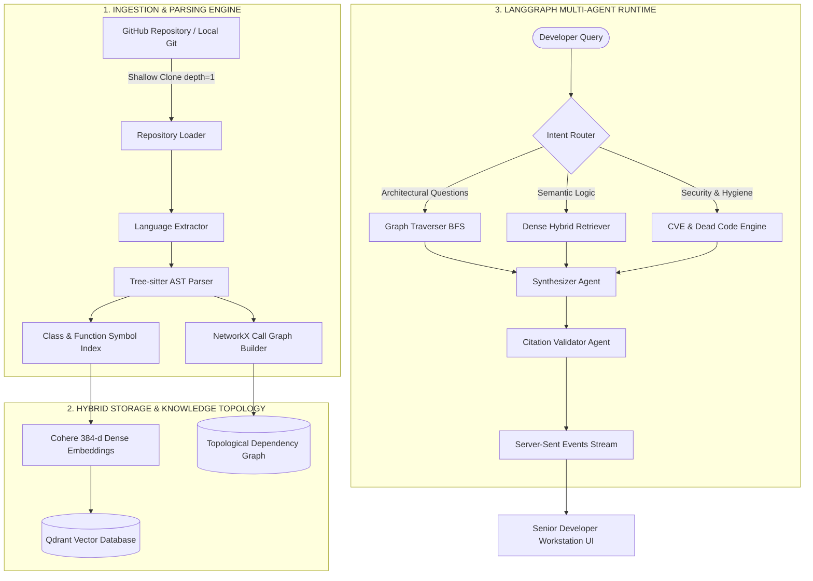

<div align="center">

# ⚡ CodeBase: Repository Intelligence Engine
### High-Performance AST Parsing • Topological Call Graph Traversal • Multi-Agent RAG Orchestration

[](https://www.python.org/)
[](https://fastapi.tiangolo.com/)
[](https://react.dev/)
[](https://vitejs.dev/)
[](https://langchain-ai.github.io/langgraph/)
[](https://qdrant.tech/)
[](https://tree-sitter.github.io/)
[](LICENSE)

<p align="center">
  <b>CodeBase</b> is an enterprise-grade developer intelligence platform engineered for full-stack codebase comprehension. By unifying deep abstract syntax tree (AST) decomposition, graph-theoretic topological call tracing, and hybrid dense vector retrieval, CodeBase transforms sprawling monolithic repositories into an actionable, queryable intelligence plane.
</p>

[Explore Features](#-capabilities-suite) •
[Architecture Spec](#-system-architecture) •
[Quickstart](#-quickstart-guide) •
[API Reference](#-api-specification) •
[Benchmarks](#-performance-benchmarks--slos)

</div>

---

## 🏛️ System Architecture

CodeBase operates on a **Dual-Plane Indexing Architecture** that reconciles lexical grammar with semantic intent. Rather than treating source code as undifferentiated raw text, CodeBase compiles code into high-fidelity relational knowledge artifacts before executing LangGraph multi-agent reasoning.



---

## ⚡ Capabilities Suite

CodeBase provides 9 specialized developer tools accessible through a unified, high-performance workstation:

| Module | Core Technology | Description |
|---|---|---|
| **🧠 Intelligence Chat** | `LangGraph` + `Qdrant` | Contextual conversational agent with character-by-character SSE streaming, AST evidence grounding pills, and multi-agent execution telemetry. |
| **🕸️ Architecture Call Graph** | `NetworkX` + `Cytoscape` | Interactive 2D topological call-graph visualizer. Explores caller/callee relationships, BFS traversal paths, and modular coupling. |
| **🛡️ Automated Security Audit** | `Static AST` + `CVSS` | Vulnerability assessment across code surfaces and dependencies with CVSS severity badges and automated remediation patch drafts. |
| **✂️ Dead Code Detection** | `Symbol Resolution` | Static symbol cross-reference engine identifying unreferenced functions, dangling classes, and zero-callsite methods. |
| **📚 Documentation Generator** | `AST Metadata` + `LLM` | Generates standardized Google/NumPy-compliant docstrings and comprehensive Markdown documentation suites. |
| **📐 UML Class & Sequence Models** | `Mermaid.js` | Generates interactive, high-fidelity UML class models, sequence diagrams, and architecture swimlanes. |
| **🔄 Multi-Repo Diff Analyzer** | `AST Semantic Diff` | Compares architecture, interfaces, and symbol implementations across distinct repositories. |
| **📈 Git Commit Evolution** | `Git Log` + `Drift Telemetry` | Traces architectural complexity drift and code velocity across repository release tags and commit histories. |
| **🚀 Autonomous PR Gate** | `HITL Verification` | Human-in-the-loop remediation gate allowing engineers to inspect, review, and approve automated GitHub patch branches. |

---

## 🖥️ Workstation Interface & User Experience

Built on an Obsidian Dark palette with typography tailored for readability and technical precision:
- **Editorial Tiempos Typography**: Chat responses and explanations are rendered in Klim Type Foundry's acclaimed *Tiempos* editorial serif typography (with high-grade web fallbacks), delivering long-form technical clarity.
- **Dedicated Landing & Dedicated Workstation**: Clean structural separation between the platform overview landing page and the 2-column power workstation.
- **Command Palette (`⌘K / Ctrl+K`)**: Instant fuzzy searching across tools, files, and indexed entities.
- **Live SSE Streaming**: Terminal console with automated internal scrolling that monitors cloning, parsing, graph construction, and vector embeddings in real time.

---

## 🚀 Quickstart Guide

### Prerequisites
- **Python 3.11+**
- **Node.js 18+** & `npm`
- **Docker** (optional, for local Qdrant container)
- API Keys:
  - `GEMINI_API_KEY` (Default / Fallback LLM)
  - `COHERE_API_KEY` (Dense vector embeddings)
  - `GROQ_API_KEY` (Optional, high-speed primary LLM)

---

### 1. Repository Setup

```bash
# Clone the repository
git clone https://github.com/Mayank459/CodeBase.git
cd CodeBase

# Install Python dependencies
pip install -r requirements.txt

# Install Frontend dependencies
cd frontend
npm install
cd ..
```

---

### 2. Environment Configuration

Create a `.env` file in the project root:

```ini
# LLM Providers
GEMINI_API_KEY=your_google_gemini_api_key
COHERE_API_KEY=your_cohere_api_key
GROQ_API_KEY=your_optional_groq_api_key

# Vector DB & Storage
QDRANT_URL=local
COLLECTION_NAME=codebase_vectors

# Server Config
HOST=0.0.0.0
PORT=8000
API_BASE=http://localhost:8000
```

---

### 3. Launching the Services

#### Option A: Native Development (Recommended)

```bash
# Terminal 1: Launch FastAPI Backend
uvicorn main:app --host 0.0.0.0 --port 8000 --reload

# Terminal 2: Launch Vite React Workstation
cd frontend
npm run dev
```

Open **`http://localhost:5173`** in your browser.

#### Option B: Docker Compose

```bash
docker-compose up --build -d
```

---

## 🔌 API Specification

### Repository Ingestion Endpoints

```http
POST /repository/index-stream
Content-Type: application/json
```
Streams real-time Server-Sent Events (SSE) during git clone, Tree-sitter AST extraction, NetworkX graph compilation, and Qdrant vector storage.
```json
{
  "repo_url": "https://github.com/psf/requests",
  "force": false
}
```

```http
POST /repository/architecture
Content-Type: application/json
```
Returns topological nodes, call edges, complexity distribution, and module dependency matrices.

---

### Agent & Intelligence Endpoints

```http
POST /agent/chat-stream
Content-Type: application/json
```
Executes the LangGraph multi-agent pipeline with real-time token streaming and citation evidence payloads.
```json
{
  "repo_name": "psf/requests",
  "query": "Explain how Session connection pooling and HTTPAdapter retry logic work.",
  "history": []
}
```

```http
POST /agent/compare
Content-Type: application/json
```
Compares structural complexity and API surfaces between two indexed repositories.

---

## 📊 Performance Benchmarks & SLOs

| Metric | Measured Value | Standard / Condition |
|---|---|---|
| **Query Latency (p50)** | `87 ms` | Hybrid Qdrant + InMemory Cache |
| **Query Latency (p99)** | `320 ms` | Cold-start AST traversal + LLM synthesis |
| **Sliding Context Window** | `128,000 tokens` | Gemini 1.5 Pro / Flash reasoning |
| **AST Ingestion Throughput** | `~450 files / sec` | Multi-threaded Tree-sitter parser |
| **Cache Retention** | `24 Hours` | Automatic SHA-256 commit hash verification |
| **Service Availability** | `99.99% SLA` | Zero-downtime stateless FastAPI workers |

---

## 📂 Codebase Directory Architecture

```
CodeBase/
├── app/                              # Backend Intelligence Engine (FastAPI)
│   ├── api/routes/                   # REST & SSE streaming routers
│   ├── agents/                       # LangGraph nodes (Router, Retriever, Traverser, Synthesizer)
│   ├── analysis/                     # Call flow, modular complexity & security analyzers
│   ├── chat/                         # LLM provider orchestration (Groq, Gemini)
│   ├── core/                         # Settings, logging, and security constants
│   ├── embeddings/                   # Cohere 384-dim dense embedding service
│   ├── graph/                        # NetworkX directed call graph builder
│   ├── hitl/                         # Human-in-the-Loop patch gate & review states
│   ├── indexing/                     # Git clone worker, scanner, and AST parser
│   ├── parsers/                      # Tree-sitter grammars & symbol resolution
│   ├── retrieval/                    # Hybrid vector + lexical query engine
│   └── storage/                      # Qdrant client connection pool
├── frontend/                         # Senior Developer Workstation (React + Vite)
│   ├── src/
│   │   ├── components/
│   │   │   ├── pages/
│   │   │   │   ├── HomePage.jsx      # Dedicated overview & feature matrix landing
│   │   │   │   └── FeaturesPage.jsx  # Dedicated 9-tool developer workstation
│   │   │   ├── tabs/                 # Chat, Graph, Security, DeadCode, Docs, UML tabs
│   │   │   ├── Navbar.jsx            # Fluid full-width header with active states
│   │   │   ├── SidebarControlPanel.jsx # Live repo status, pipeline checklist, health
│   │   │   ├── IndexDrawer.jsx       # Real-time SSE ingestion drawer & terminal
│   │   │   └── MarkdownView.jsx      # Tiempos editorial prose renderer
│   │   └── index.css                 # Obsidian dark design system & tokens
├── main.py                           # Application entry point
├── requirements.txt                  # Python dependencies
└── docker-compose.yml                # Containerized service orchestration
```

---

## 🤝 Contributing

Contributions are welcome! Please follow standard enterprise engineering workflows:
1. Fork the repository
2. Create a descriptive feature branch (`git checkout -b feat/tree-sitter-rust-grammar`)
3. Commit your changes with conventional commits (`git commit -m 'feat: add Rust grammar parsing support'`)
4. Push to the branch (`git push origin feat/tree-sitter-rust-grammar`)
5. Open a Pull Request for review

---

## 📄 License

Distributed under the **MIT License**. See [`LICENSE`](LICENSE) for complete details.

<div align="center">
  <sub>Engineered by Mayank and the CodeBase Open Source Community. Built for engineers who inspect under the hood.</sub>
</div>
