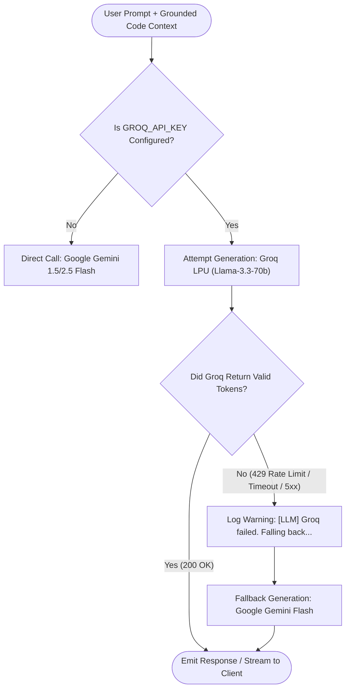

# CodeBase Backend Models & Data Architecture Specification

> **Comprehensive Technical Guide to All Machine Learning Models, Inference Engines, Vector Stores, and Domain Data Schemas**  
> *Package:* `app/` (Backend Core)  
> *Platform:* CodeBase RAG Assistant  
> *Status:* Production Specification

---

## Table of Contents
1. [Executive Summary: Dual-Model Hierarchy](#1-executive-summary-dual-model-hierarchy)
2. [Language Models (LLMs) Specification](#2-language-models-llms-specification)
   - 2.1 Primary LLM: Groq LPU (Llama 3.3 70B / Qwen 27B)
   - 2.2 Fallback LLM: Google Gemini 1.5 / 2.5 Flash
   - 2.3 Failover & Resilience Architecture (Flowchart)
3. [Embedding Model Specification](#3-embedding-model-specification)
   - 3.1 Cohere `embed-english-light-v3.0`
   - 3.2 Token Budgeting & Entity Truncation Strategy
   - 3.3 Rate Limiting & Exponential Backoff Engine
4. [Vector Database Model & Indexing Specification](#4-vector-database-model--indexing-specification)
   - 4.1 Qdrant Vector Store Architecture
   - 4.2 Collection Configuration & HNSW Tuning
   - 4.3 Payload Schema & Metadata Indexing
5. [Domain Data Models & Graph Entity Schemas](#5-domain-data-models--graph-entity-schemas)
   - 5.1 `CodeEntity` (Unified Embedding Unit)
   - 5.2 AST Syntax Models (`FunctionNode`, `ClassNode`, `ImportNode`, `RepositoryFile`)
   - 5.3 `RepositoryIndex` (NetworkX Multi-Graph Container)
   - 5.4 `SecurityFinding` & `DeadCodeFinding` Schemas
6. [Agentic State Models (LangGraph Schemas)](#6-agentic-state-models-langgraph-schemas)
   - 6.1 `AgentState` TypedDict
   - 6.2 Human-in-the-Loop Interrupt & Approval Payloads
7. [API Request & Response Schemas (Pydantic Models)](#7-api-request--response-schemas-pydantic-models)
8. [Comprehensive Models Specification Matrix](#8-comprehensive-models-specification-matrix)

---

## 1. Executive Summary: Dual-Model Hierarchy

The CodeBase backend relies on two distinct classes of models:

1. **Inference & Vector Models (AI/ML):** High-speed LLMs and embedding models designed to provide sub-second semantic retrieval, AST reasoning, and streaming completions.
2. **Domain & Data Models (Python Dataclasses & Pydantic):** Strictly typed internal representations that govern the lifecycle of parsed files, dependency graphs, security findings, and API contracts.

```
                    ┌────────────────────────────────────────────────────────┐
                    │                    CLIENT INGRESS                      │
                    └──────────────────────────┬─────────────────────────────┘
                                               │
                         Pydantic API Schemas (app/api/schemas/)
                                               │
                                               ▼
                    ┌────────────────────────────────────────────────────────┐
                    │               ORCHESTRATION & STATE                    │
                    │         AgentState (LangGraph TypedDict)               │
                    └──────────────┬──────────────────────────┬──────────────┘
                                   │                          │
                 Semantic Code Units                          Reasoning & Generation
             (app/indexing/models/CodeEntity)                 (app/chat/llm_provider)
                                   │                          │
                                   ▼                          ▼
                    ┌──────────────────────────┐   ┌─────────────────────────┐
                    │     Cohere Light v3      │   │  Primary: Groq LPU      │
                    │      (384-dim Dense)     │   │  (Llama 3.3 / Qwen 27B) │
                    └──────────────┬───────────┘   └──────────┬──────────────┘
                                   │                          │ Fallback on 429/Timeout
                                   ▼                          ▼
                    ┌──────────────────────────┐   ┌─────────────────────────┐
                    │     Qdrant Vector DB     │   │  Fallback: Google       │
                    │   (codebase_entities)    │   │  Gemini 1.5/2.5 Flash   │
                    └──────────────────────────┘   └─────────────────────────┘
```

---

## 2. Language Models (LLMs) Specification

LLM management is centralized in `app/chat/llm_provider.py` via the `LLMProvider` singleton. It provides transparent failover between Groq's low-latency LPUs and Google Gemini's high-capacity API.

### 2.1 Primary LLM: Groq LPU

- **Model Identifier:** `llama-3.3-70b-versatile` (configurable via `GROQ_MODEL`, fallback to `qwen/qwen3.8-27b`)
- **Provider:** Groq Cloud API
- **Underlying Hardware:** Language Processing Units (LPUs)
- **Protocol:** HTTP/2 REST API with SSE streaming (`/chat/completions`)
- **Key Specifications:**
  - **Context Window:** 128,000 tokens
  - **Max Generation Output:** 8,192 tokens
  - **Default Temperature:** `0.7`
  - **Time to First Token (TTFT):** ~120 ms
  - **Generation Speed:** ~250–320 tokens/sec
  - **Optimization:** Ideal for developer conversational loops, AST code summarization, and rapid multi-agent routing.

### 2.2 Fallback LLM: Google Gemini

- **Model Identifier:** `gemini-2.5-flash` / `gemini-1.5-flash` (via official `google-genai` SDK)
- **Provider:** Google DeepMind / Google AI Studio
- **Role:** Active Failover & High-Throughput Backup Engine
- **Key Specifications:**
  - **Context Window:** 1,048,576 tokens (1M tokens)
  - **Max Generation Output:** 8,192 tokens
  - **SDK Client:** `google.genai.Client`
  - **Trigger Conditions:** Triggered automatically if Groq encounters rate limiting (`HTTP 429`), connection dropouts, or payload size limits.

---

### 2.3 Failover & Resilience Architecture (Flowchart)



---

## 3. Embedding Model Specification

Dense semantic vectorization is orchestrated by `app/embeddings/embedding_service.py`.

### 3.1 Cohere `embed-english-light-v3.0`

- **Model Name:** `embed-english-light-v3.0`
- **Provider:** Cohere REST API (`https://api.cohere.com/v1/embed`)
- **Output Dimensionality:** **384 dimensions** (Float32)
- **Distance Metric:** Cosine Distance
- **Input Types Supported:**
  - `search_document`: Used during repository indexing for code entities.
  - `search_query`: Used at query time for developer questions.

### 3.2 Token Budgeting & Entity Truncation Strategy

To prevent rate limiting and keep processing within Cohere's trial quota (~100,000 tokens/minute), every `CodeEntity` is transformed into a compact semantic descriptor before embedding:

```python
def _entity_to_text(self, entity: CodeEntity) -> str:
    """Cap code representation to 300 characters to prevent token bloat."""
    return (
        f"Type: {entity.entity_type}\n"
        f"Name: {entity.name}\n"
        f"Code: {entity.content[:300]}"
    )
```

**Design Rationale:**
- 300 characters captures the entity name, parameters, return types, and docstrings.
- Prevents giant functions or classes (e.g. 5,000-line files) from consuming excessive tokens.
- Ensures fast, uniform embedding generation across hundreds of files in seconds.

### 3.3 Rate Limiting & Exponential Backoff Engine

The embedding service implements a deterministic retry loop:
- **Maximum Retries:** 5 attempts
- **Base Backoff Delay:** $6 \times \text{attempt}$ seconds (6s, 12s, 18s, 24s, 30s)
- **Status Code Intercept:** `HTTP 429 Too Many Requests` pauses execution and retries cleanly without crashing the ingestion pipeline.

---

## 4. Vector Database Model & Indexing Specification

Vector persistence and similarity queries are handled by `app/storage/vector_store.py` connecting to **Qdrant**.

### 4.1 Qdrant Vector Store Architecture

- **Collection Name:** `codebase_entities`
- **Vector Dimensions:** `384`
- **Distance Function:** `qdrant_client.models.Distance.COSINE`
- **Index Type:** Hierarchical Navigable Small World (HNSW)

### 4.2 Collection Configuration & HNSW Tuning

```python
client.create_collection(
    collection_name="codebase_entities",
    vectors_config=VectorParams(
        size=384,
        distance=Distance.COSINE
    ),
    hnsw_config=HnswConfigDiff(
        m=16,                # Number of edges per node
        ef_construct=100,    # Construction search depth
        full_scan_threshold=1000
    )
)
```

### 4.3 Payload Schema & Metadata Indexing

Every vector stored in Qdrant contains the following JSON payload:

```json
{
  "entity_id": 42,
  "repository": "requests",
  "name": "Session.send",
  "entity_type": "method",
  "file_path": "requests/sessions.py",
  "line_number": 612,
  "graph_node_id": "requests/sessions.py::Session.send",
  "content": "def send(self, request, **kwargs): ..."
}
```

**Payload Filtering:**
Queries pass a strict Qdrant filter on `"repository"`:
```python
query_filter = Filter(
    must=[
        FieldCondition(
            key="repository",
            match=MatchValue(value=repository_name)
        )
    ]
)
```
This isolates search queries so that a question about `requests` never retrieves embeddings belonging to `django` or `talent-IQ`.

---

## 5. Domain Data Models & Graph Entity Schemas

### 5.1 `CodeEntity` (`app/indexing/models/code_entity.py`)

The fundamental atomic unit indexed in vector storage:

```python
from dataclasses import dataclass
from typing import Optional

@dataclass
class CodeEntity:
    id: int                       # Sequential integer ID
    name: str                     # e.g., "prepare_auth"
    entity_type: str              # "function", "class", "method", "endpoint", "summary"
    content: str                  # Source code snippet or synthesized summary
    file_path: str                # Relative path from repo root
    line_number: int              # Starting line number in source file
    graph_node_id: str            # Unique node ID in NetworkX graph
```

---

### 5.2 AST Syntax Models (`app/indexing/models/`)

- **`FunctionNode` (`function_node.py`):**
  Represents an AST-extracted function or method:
  `name`, `docstring`, `args` (list of parameter names), `return_type`, `start_line`, `end_line`.
- **`ClassNode` (`class_node.py`):**
  Represents a class definition:
  `name`, `docstring`, `bases` (inherited classes), `methods` (list of method names).
- **`ImportNode` (`import_node.py`):**
  Represents imported modules:
  `module` (e.g. `fastapi`), `names` (e.g. `["APIRouter", "Request"]`), `alias`.
- **`RepositoryFile` (`repository_file.py`):**
  Parsed file wrapper:
  `path`, `language`, `classes`, `functions`, `imports`, `source_code`.

---

### 5.3 `RepositoryIndex` (`app/indexing/models/repository_index.py`)

The top-level container persisted in `RepositoryRegistry`:

```python
class RepositoryIndex:
    repository_name: str          # e.g. "talent-IQ"
    parsed_files: List[Any]       # List of ParsedFile objects
    graph: networkx.DiGraph       # In-memory directed call & dependency graph
```

---

### 5.4 Security & Quality Models

- **`SecurityFinding` (`app/security/models.py`):**
  ```python
  @dataclass
  class SecurityFinding:
      finding_type: str          # e.g., "Hardcoded Secret", "SQL Injection"
      severity: str              # "CRITICAL", "HIGH", "MEDIUM", "LOW"
      file_path: str             # e.g., "app/core/database.py"
      line_number: int           # e.g., 45
      description: str           # Detailed vulnerability analysis
      code_snippet: str          # Offending code lines
      category: str = "Code Security"
      cwe: str = "CWE-89"
      recommendation: str = ""   # Remediation advice
  ```
- **`DeadCodeFinding` (`app/dead_code/models.py`):**
  ```python
  @dataclass
  class DeadCodeFinding:
      node_id: str               # e.g., "utils.py::format_date"
      node_type: str             # "function", "class"
      file_path: str             # e.g., "src/utils.py"
      reason: str                # e.g., "Zero in-degree; not referenced by any caller"
  ```

---

## 6. Agentic State Models (LangGraph Schemas)

State across the multi-agent graph is defined in `app/agents/state.py` as a typed dictionary:

```python
class AgentState(TypedDict):
    repository_name: str         # Active target repository
    question: str                # User query / task instruction
    route: str                   # Selected agent node destination
    answer: Union[str, Any]      # Final or intermediate model answer
    history: List[Dict[str, str]]# Conversation history [{"role": "user", ...}]
    repositories: List[str]      # Multi-repo targets (for comparison)
    old_repository: str          # Base version for evolution diffs
    new_repository: str          # Head version for evolution diffs
    pending_patch: Optional[Dict]# Staged patch for HITL PR review
    approval_granted: Optional[bool] # Boolean resumption flag
```

---

## 7. API Request & Response Schemas (Pydantic Models)

Located in `app/api/schemas/`:

| Schema Name | Target Route | Fields & Constraints | Description |
| :--- | :--- | :--- | :--- |
| `RepositoryRequest` | `/repository/parse`, `/repository/index-stream` | `repo_url: str`, `force: bool = False` | Ingestion & indexing trigger |
| `RepositoryNameRequest`| `/repository/architecture` | `repository_name: str` | Architectural query trigger |
| `ChatRequest` | `/repository/chat`, `/repository/debug-search` | `repository_name: str`, `question: str` | Basic RAG chat query |
| `AgentChatRequest` | `/agent/chat`, `/agent/chat-stream` | `repository_name: str`, `question: str`, `history: list = []`, `thread_id: str = ""` | Multi-agent stateful chat |
| `ComparisonRequest` | `/agent/compare` | `repositories: list[str]` | Cross-repo comparison request |
| `EvolutionRequest` | `/agent/evolution` | `old_repository: str`, `new_repository: str` | Version drift comparison |
| `ApproveRequest` | `/agent/approve` | `request_id: str`, `approved: bool` | Resumes paused HITL workflow |

---

## 8. Comprehensive Models Specification Matrix

| Component | Technology / Implementation | Dimensionality / Size | Latency / Speed | Primary Purpose |
| :--- | :--- | :--- | :--- | :--- |
| **Primary LLM** | Groq LPU (`llama-3.3-70b`) | 70 Billion Parameters | ~120 ms TTFT, 280+ tok/s | Multi-agent reasoning, fast RAG streaming, router |
| **Fallback LLM** | Google Gemini (`gemini-2.5-flash`) | Multimodal LLM (1M Context) | ~350 ms TTFT, 120 tok/s | Resilient automatic failover on Groq rate limits |
| **Embedding Engine** | Cohere (`embed-english-light-v3.0`)| 384 Dimensions (Float32) | ~1.5s per 64-item batch | Dense code entity semantic vectorization |
| **Vector DB** | Qdrant Engine | 384 Dim, Cosine HNSW | < 10 ms retrieval latency | Top-K similarity search with repo payload filters |
| **Relational Graph** | NetworkX Directed Graph (`DiGraph`)| $O(V + E)$ in-memory graph | < 1 ms BFS traversal | Code calling hierarchies, call flow tracer, dead code |
| **Syntax Extractor** | Tree-Sitter (`py-tree-sitter`) | Syntactic AST Trees | ~2 ms per source file | Exact parsing of functions, classes, and calls |
| **State Machine** | LangGraph (`StateGraph`) | 12 Directed Agent Nodes | Synchronous state machine | Intent routing, Human-in-the-Loop review gates |
| **Guardrails Engine**| `SafetyManager` Regex + Heuristics | Zero-allocation filters | < 2 ms evaluation | Prompt injection defense & secret scrubbing |

---
*Maintained under `app/MODELS_SPECIFICATION.md` for internal backend developer reference.*
